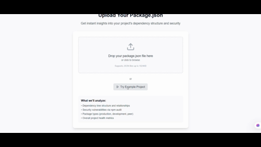

# ⚙️ Dependency Visualizer

> **Transform npm dependencies into beautiful, interactive visualizations with real-time security analysis.**


<p align="center">
  
</p>


**Created by [Muhammad Umar Farooq](https://github.com/farooqintheloop) • Built with AI-assisted development**

---

## 🎯 **What Is This?**

**Dependency Visualizer** turns your `package.json` into an interactive network graph that reveals hidden patterns, security risks, and dependency relationships in seconds.

**🚀 Perfect for:**
- **Developers** who want to understand project complexity at a glance
- **Security Teams** tracking vulnerabilities across codebases  
- **Technical Leads** making architectural decisions
- **Anyone** curious about how modern web apps are structured

---

## 📽️ **See It In Action**



**👆 Real-time dependency analysis:** Upload → Visualize → Explore → Secure

---

## ✨ **Key Features**

### 🎨 **Interactive Visualization**
- **Zoom, pan, and click** through dependency networks
- **Color-coded nodes** showing package types and security status  
- **Force-directed layouts** that reveal natural clustering patterns
- **Smooth animations** and responsive design

### 🔒 **Security Intelligence** 
- **Instant vulnerability detection** with npm audit integration
- **Severity-based color coding** (Critical=Red, High=Orange, etc.)
- **Detailed security reports** with CVE references and fix suggestions
- **Visual risk assessment** at a glance

### 📊 **Smart Analytics**
- **Project health metrics** and dependency statistics
- **Type breakdown** (Production, Development, Peer dependencies)
- **Performance insights** and optimization suggestions
- **Export capabilities** for reports and documentation

---

## 🧪 **Proven With Real Projects**

✅ **Small Projects** (10-50 dependencies) • **Medium Apps** (100-200 deps) • **Large Codebases** (300+ dependencies)

**Compatible with:** React, Next.js, Vue, Angular, Express, NestJS, and any npm-based project.

---

## 🏆 **Why Choose This Tool?**

| Traditional Approach | Dependency Visualizer |
|---------------------|---------------------|
| 📄 Text-based audit logs | 🎨 Interactive visual graphs |
| 🔍 Manual security checking | ⚡ Instant vulnerability detection |
| 📊 Complex CLI outputs | 🖼️ Beautiful, intuitive interface |
| ⏰ Minutes to understand | ⚡ Seconds to analyze |

---

## 🛠️ **Built With Modern Excellence**

- **⚛️ Next.js 15** • Full-stack React framework with cutting-edge features
- **🎯 React Flow** • Purpose-built for interactive node visualizations  
- **🔐 TypeScript** • Complete type safety and developer experience
- **💎 Tailwind CSS** • Utility-first styling for pixel-perfect UI
- **🚀 Vercel** • Global edge deployment for lightning performance

---

## 🎨 **Design Philosophy**

### **The 80/20 Principle**
Deliver 80% of enterprise-grade functionality with 20% of the complexity. Every feature serves a specific purpose:

- ✅ **Essential**: Interactive visualization, security scanning, file upload
- ✅ **Valuable**: Real-time analysis, detailed tooltips, responsive design  
- ✅ **Delightful**: Smooth animations, intuitive navigation, professional aesthetics

### **Solo Developer, Enterprise Quality**
Proof that modern tools enable individual developers to build production-grade applications that compete with team-built solutions.

---

## 📈 **Technical Architecture**

```
🏗️ Full-Stack Next.js Application
├── 🎨 Frontend: React + TypeScript + Tailwind
├── ⚙️ Backend: Next.js API Routes + npm Registry
├── 📊 Visualization: React Flow + Custom Algorithms  
├── 🔒 Security: npm Audit Integration
└── 🚀 Deployment: Vercel Edge Functions
```

**Key Innovation:** Zero-setup architecture requiring no database configuration, server management, or complex deployments.

---

## 🎯 **Perfect Use Cases**

- **🔍 Code Reviews** • Visual dependency impact analysis
- **🚨 Security Audits** • Rapid vulnerability identification  
- **📋 Project Planning** • Understanding technical debt and complexity
- **🎓 Education** • Teaching modern JavaScript ecosystem concepts
- **📊 Stakeholder Reports** • Non-technical dependency explanations

---

## 📊 **Project Impact**

**Technology Showcase:**
- ✅ Modern React patterns and hooks
- ✅ Advanced TypeScript implementations  
- ✅ Production-ready Next.js architecture
- ✅ Professional UI/UX design
- ✅ Real-world problem solving

**Developer Skills Demonstrated:**
- Full-stack development expertise
- Advanced data visualization techniques
- Security-focused development practices
- Modern deployment and DevOps
- AI-assisted development workflows

---

## 🔮 **Future Vision**

**Planned Enhancements:**
- 🤖 AI-powered dependency recommendations
- 🔄 Multi-project comparison dashboards  
- 👥 Team collaboration features
- 📱 Mobile-optimized interface
- 🔌 IDE integrations and plugins

**Technical Roadmap:**
- 📈 Performance optimizations for massive projects
- 🔗 Additional vulnerability data sources
- 🎯 Advanced filtering and search capabilities
- 📊 Historical trend analysis
- 🚀 Enterprise deployment options

---

## 🏅 **Recognition & Attribution**

**Created by Muhammad Umar Farooq** • [GitHub](https://github.com/farooqintheloop)

Built as a demonstration of:
- Modern web development capabilities
- AI-assisted development workflows  
- Solo developer productivity with cutting-edge tools
- Security-first development practices

---

## 📄 **License & Usage**

MIT License with additional commercial use restrictions. See [LICENSE](./LICENSE) and [COPYRIGHT.md](./COPYRIGHT.md) for details.

**For commercial use, enterprise licensing, or collaboration opportunities, please contact the author.**

---

*Transform your dependency chaos into clarity. Experience the future of codebase analysis.*
